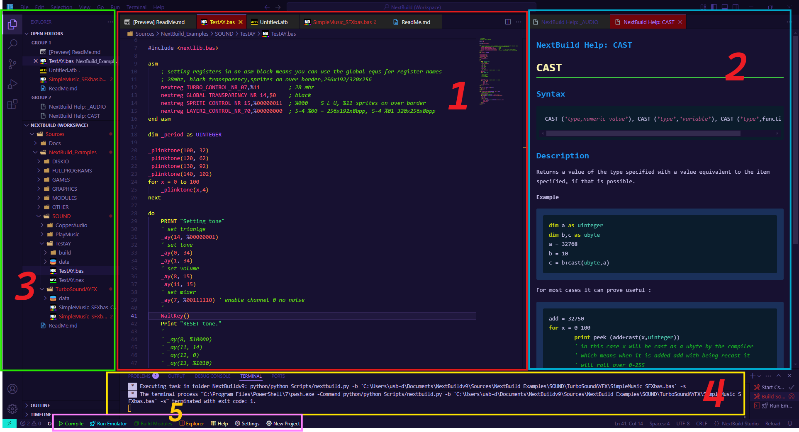

# 🖥️ The NextBuild Studio Window

Five areas, and once you know which is which the rest of the app makes sense.

| | Area | What it does |
|---|---|---|
| **1** | **Editor** | Where you write `.bas` files. Tabs across the top, breadcrumbs under them, minimap down the side. Press `F1` on any keyword to open its help. |
| **2** | **Help System** | Inline documentation, opened with `F1`. Shows syntax, description and a worked example for the keyword under the cursor. `F1` on empty space opens the full help index. |
| **3** | **Explorer** | Your workspace tree — `Sources`, `NextBuild_Examples`, and whatever projects you add. **Open Editors** at the top lists everything you have open. |
| **4** | **Console** | Problems, Output, Debug Console, Terminal and Ports. The compiler's output lands in **Terminal**; build errors also appear in **Problems**. |
| **5** | **Action buttons** | The bar along the bottom. See below. |

---

## 🎛️ **The Action Buttons**

| Button | Does |
|---|---|
| **Help** | Opens the help system — the same thing as `F1` |
| **New Project** | Creates a project from a template (see [Templates](Templates.md)) |
| **Compile & Run** | Builds the current `.bas` and launches it in CSpect |
| **Run Emulator** | Starts CSpect on the last build, without recompiling |
| **Build Modules** | Rebuilds every module in a multi-module project |
| **Single Module** | Rebuilds just the module you are editing — much quicker while working on one |
| **Start NextZXOS** | Boots CSpect into NextZXOS rather than straight into your program |
| **Explorer** | Opens the project folder in your system file manager |
| **Settings** | NextBuild Studio settings (see [Settings](Settings.md)) |

💡 <strong>Tip:</strong> Every button has a keyboard shortcut too — see
<a href="KeyboardInput.md">Keyboard &amp; Controls</a>.

---

## 🔍 **Getting Back Here**

Wandered off? **Right-click** `ReadMe.md` in the Explorer and choose **Open Preview**.

---

## Links

* [Introduction](Introduction.md)
* [Keyboard & Controls](KeyboardInput.md)
* [The Editors](Editors.md)
* [Settings](Settings.md)
* [Templates](Templates.md)
